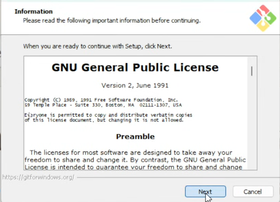
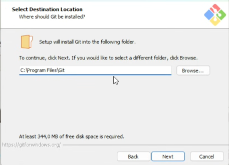
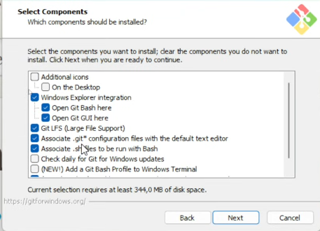
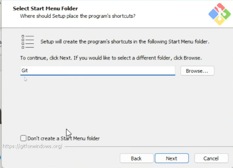
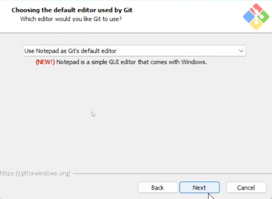
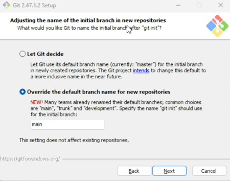

## 🛠️ Como instalar o Git.
Tempo de instalação: Aproximadamente 15 minutos.

### Passo 1: Baixando o Git

- Acesse o site oficial do Git: [https://git-scm.com/downloads](https://git-scm.com/downloads).
- Selecione o sistema operacional que você está usando (Windows, macOS ou Linux).
- Clique em "Click here to download" para baixar o instalador. 
- Aceite as permissões, caso solicitado.

### Passo 2: Executando o Instalador

- Clique em **Next** na primeira tela (*General Public License*).

- Local de instalação: mantenha o diretório padrão e clique em **Next**.

- Na tela de seleção de componentes (*Select Components*), certifique-se de marcar a opção **Windows Explorer integration**. Dentro dela, marque as duas opções: Deixe as opções padrão 
*   `Git Bash Here`
*   `Git GUI Here`
* Mantenha as demais opções como estão e clique em **Next**.

::: {.callout-note}
A integração com o Windows Explorer permitirá que você clique com o botão direito em qualquer pasta do seu computador e abra o terminal do Git diretamente lá.
:::

- Select Start Menu Folder: Deixe o padrão e clique em **Next**.

- O Editor Padrão - Choosing the default editor use by Git **(Atenção aqui!)**

::: {.callout-important}
## Evite o Vim

Por padrão, o Git utiliza o editor de texto **Vim**. Embora seja muito poderoso, ele possui comandos próprios e pode causar dificuldades para iniciantes.

Na tela **"Choosing the default editor used by Git"**, selecione:

**Notepad as Git's default editor**

Isso facilitará bastante os primeiros passos com Git.
:::
- Clique em **Next**.

Na tela **"Adjusting the name of the initial branch in new repositories"**, o Git pergunta como você quer chamar a linha principal do seu projeto. 
Historicamente chamava-se `master`, mas a convenção atual da comunidade é usar `main`.
*   Selecione a opção: **Override the default branch name for new repositories**.
*   Escreva **`main`** na caixa de texto.
Clique em **Next**.

 

A partir daqui, você pode apenas clicar em **Next** aceitando as configurações recomendadas pelo instalador:

*   **Path Environment:** Deixe em "Recommended".

*   **SSH e SSL:** Use o OpenSSH e a biblioteca OpenSSL.

*   **Line Endings:** Mantenha "Checkout Windows-style, commit Unix-style line endings".

*   **Terminal:** Deixe marcado "Use MinTTY".

*   **Git Pull:** Mantenha em "Default".

*   **Credential Manager e Caching:** Deixe as opções de File System Caching e Credential Manager habilitadas.

Clique em **Install** e aguarde a finalização!

:::{.callout-tip}
## Tudo pronto!
Com as alterações feitas, nós garantimos três coisas fundamentais: o **Git Bash** está integrado ao seu Explorer, o **Bloco de Notas** será nosso editor padrão para mensagens do Git, e nossa linha principal de desenvolvimento se chamará **main** .
:::