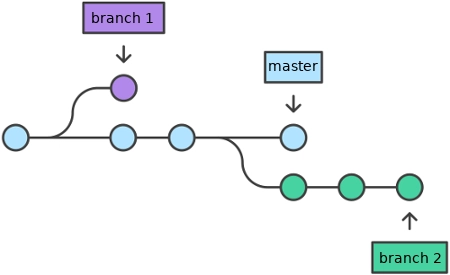

## Perdendo o medo do Terminal

O terminal é uma interface de linha de comando que permite aos usuários interagir com o sistema operacional usando comandos de texto. Embora possa parecer intimidador no início, o terminal é uma ferramenta poderosa que pode aumentar significativamente a eficiência e a produtividade.

**Abra o terminal**

- **Windows**: Pressione `Win`, digite `git bash` e pressione Enter.
- **macOS**: Pressione `Cmd + Space`, digite `Terminal` e pressione Enter.

### Comandos Básicos
O comando `pwd` (*Print Working Directory*) mostra o caminho completo da pasta atual.

```bash
$ pwd
```
O comando `ls` e `ls -a` (*List*) lista os arquivos e pastas no diretório atual.
```bash
$ ls
$ ls -a
```
O comando `cd` (*Change Directory*) é usado para navegar entre pastas.
```bash
$ cd nome_da_pasta
```
::: {.callout-tip}
**Dica**:

- Comece a digitar o nome da pasta e pressione `Tab` para autocompletar.
:::

O comando `cd ..` é usado para voltar para a pasta anterior.
```bash
$ cd ..
```
Para limpar a tela do terminal, use o comando `clear`.
```bash
$ clear
```
Ou simplesmente usar o atalho de teclado: `Ctrl + L` (muito mais rápido e prático!).

### Resumo dos Comandos
::: {.callout-note}

- `pwd`: Mostra onde está.
- `ls`: Lista o que tem.
- `cd [nome_da_pasta]`: Muda de pasta.
- `cd ..`: Volta para a pasta anterior.
- `clear`: Limpa a tela.
:::

## A Magia do Git

O git transforma a pasta comum  em um repositório, permitindo que você controle as mudanças, colabore com outros e mantenha um histórico de tudo o que foi feito.

### Iniciando um Repositório Git
Para transformar uma pasta comum em um repositório git, basta usar o comando `git init` dentro da pasta desejada (use o comando `cd` para navegar para a pasta desejada).
```bash
$ git init
```
::: {.callout-tip appearance="simple" icon="false"}
Aparentemente nada mudou, mas o Git acabou de criar uma pasta oculta chamada .git dentro do seu diretório. É lá dentro que a mágica acontece e todo o histórico do seu código será guardado. Sua pasta agora é um repositório!
:::

O comando `git status` é, talvez, o mais importante de todos. Ele mostra o status do seu repositório, indicando quais arquivos foram modificados e quais foram adicionados.
```bash
$ git status
```
::: {.callout-tip}

Use o git status o tempo todo! Digite antes de fazer qualquer coisa, durante e depois. Ele evita que você cometa erros e quebre o repositório.
:::

O comando `git add [nome_do_arquivo].formato` é usado para adicionar arquivos ao stage, preparando-os para serem commitados.
```bash
$ git add nome_do_arquivo.txt
```
Agora que você adicionou o arquivo ao stage, é hora de fazer o commit. O comando `git commit -m "mensagem do commit"` salva as mudanças no repositório com uma mensagem descritiva. É como se tirasse uma "foto" do projeto usando o comando `git commit`.
```bash
$ git commit -m "Adicionando o arquivo de exemplo"
```
::: {.callout-warning}

Boas práticas no Commit
Seja claro na sua mensagem! Imagine você lendo essa mensagem daqui a 6 meses. Evite mensagens como "git commit -m 'arrumei'" ou "git commit -m 'coisas'". Prefira: "git commit -m 'Corrige o cálculo da média na linha 42'". Siga um padrão de mensagens para facilitar a compreensão do histórico do projeto.
:::

Provavelmente será necessário fazer algumas configuraçõesno git antes de realizar o primeiro commit.

O Git precisa saber quem é você. Pense nisso como a assinatura de um documento. Toda vez que você salvar uma versão do seu trabalho, o Git vai carimbar o seu nome e e-mail nela.
```bash
$ git config --global user.name "Seu Nome"
$ git config --global user.email "Seu E-mail"
```
::: {.callout-important}

Como usamos a opção --global, você só precisa fazer essa configuração uma única vez no seu computador. O Git vai lembrar de você para todos os projetos futuros.
:::

Se tiver vários arquivos para serem comitados, use o comando `git add .` para adicionar todos os arquivos modificados de uma vez.
```bash
$ git add .
```
Use o comando `git log` para visualizar o histórico de commits do seu repositório. 
```bash
$ git log 
```
::: {.callout-tip}
Caso tenha adicionado um arquivo por engano, use o comando `git reset [nome_do_arquivo]` para removê-lo do stage.
```bash
$ git reset [nome_do_arquivo]
```
:::

Para ver a diferença entre o arquivo modificado e a última versão comitada, use o comando `git diff [nome_do_arquivo]` ou `git diff . ` para ver as diferenças de todos os arquivos.

```bash
$ git diff [nome_do_arquivo]
$ git diff .
```

### Criando nova branch



Branch é como uma linha do tempo paralela do seu projeto. Ela permite que você trabalhe em novas funcionalidades ou correções de bugs sem afetar a versão principal do código (geralmente chamada de "main" ou "master"). Para criar uma nova branch, use o comando `git checkout -b [nova_branch]`.
```bash
$ git checkout -b [nova_branch]
```
Para conferir em qual branch você está, use o comando `git branch`.
```bash
$ git branch
```
Para trocar para outra branch, use o comando `git checkout [nome_da_branch]`.
```bash
$ git checkout [nome_da_branch]
```
Apos criar um arquivo e comitar as mudanças na nova branch, é hora de juntar as mudanças da nova branch com a branch principal. Para isso, use o comando `git merge [nome_da_branch]` estando na branch principal (use o comando `git checkout main` para isso).
```bash
$ git checkout main
$ git merge [nome_da_branch]
```